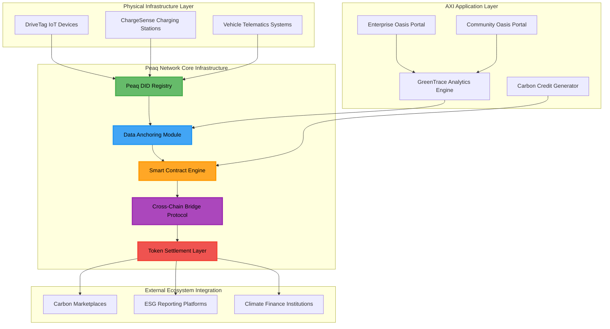
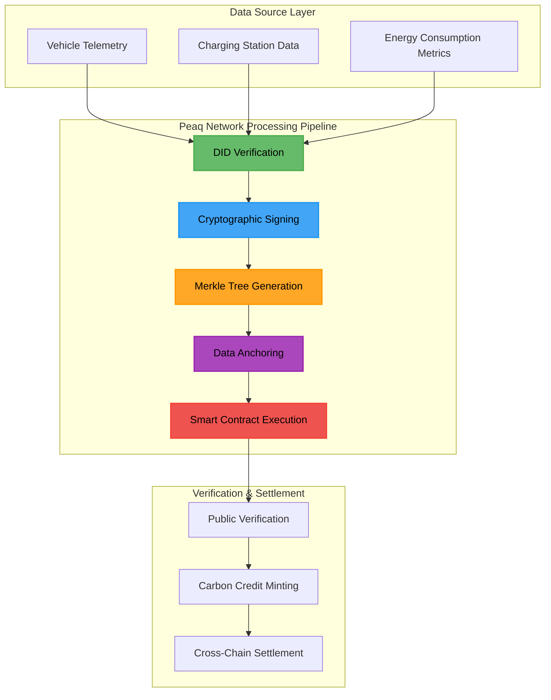
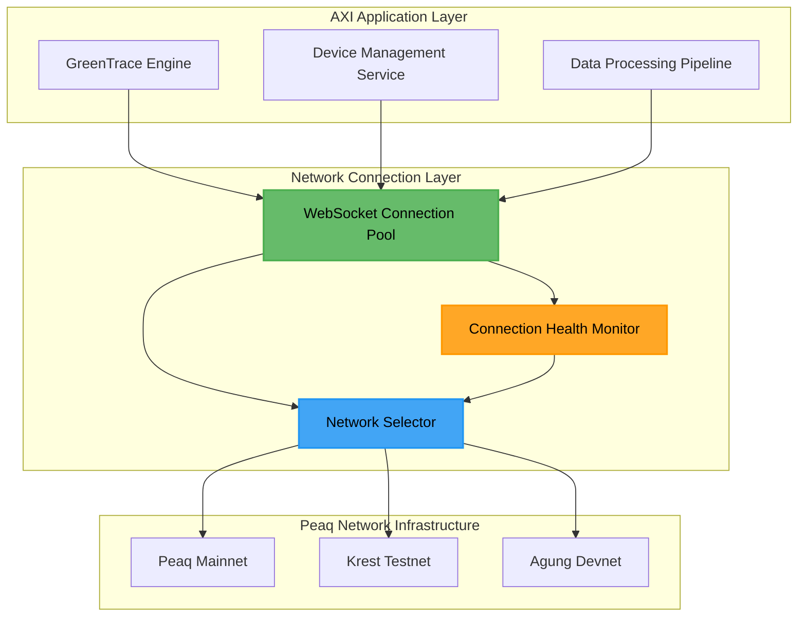
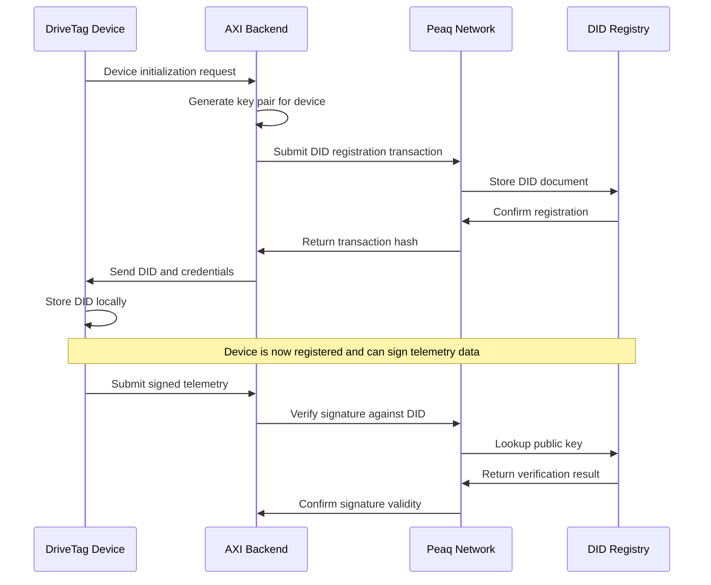
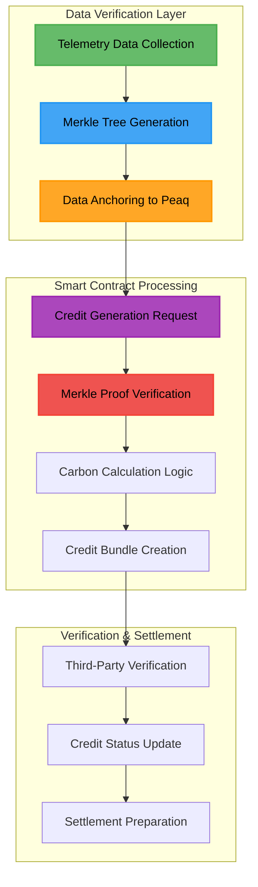
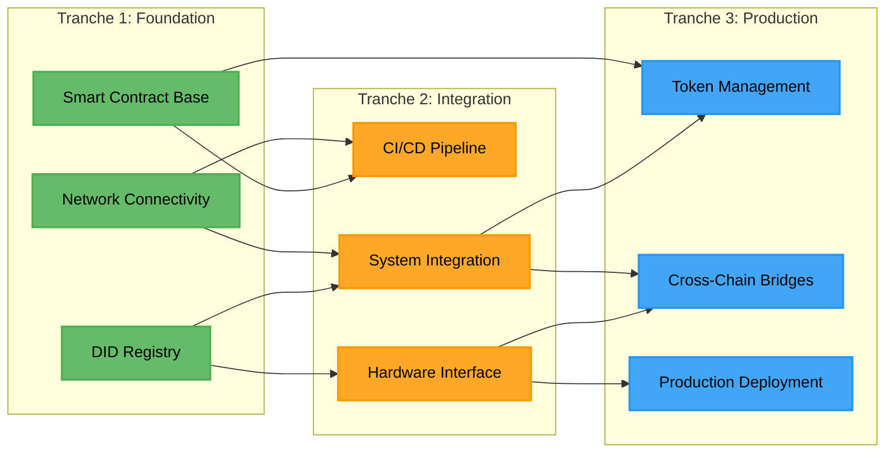
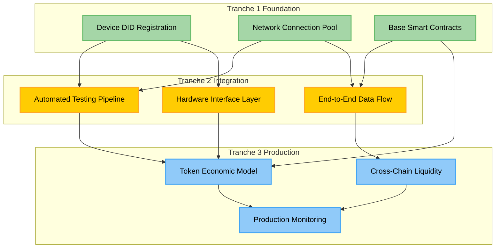
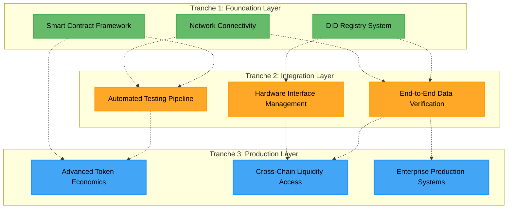
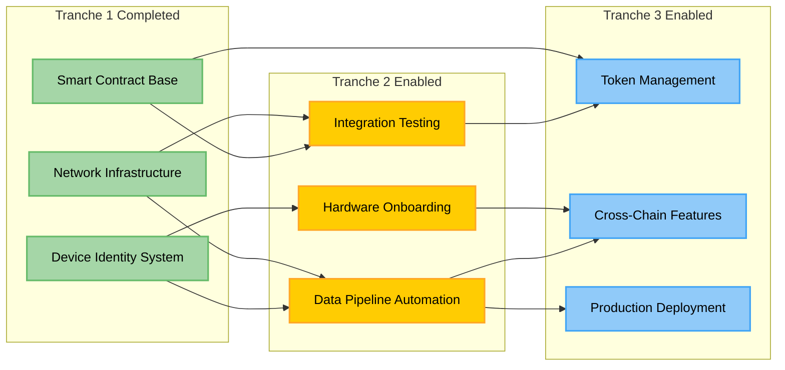

# AXI-Peaq Integration: DePIN Infrastructure for Verifiable Clean Mobility

A comprehensive technical integration implementing AXI's trust layer for clean mobility on Peaq Network's specialized DePIN blockchain infrastructure. This documentation explains the foundational implementation completed in Tranche 1 and its architectural connections to subsequent development phases.

## Table of Contents

- [System Architecture](#system-architecture)
- [Tranche 1: Foundation Implementation](#tranche-1-foundation-implementation)
- [Technical Integration Flow](#technical-integration-flow)
- [Development Pipeline](#development-pipeline)
- [Peaq Network Integration Points](#peaq-network-integration-points)
- [Cross-Tranche Dependencies](#cross-tranche-dependencies)

## System Architecture

### Complete AXI-Peaq Integration Stack

Peaq Network serves as the foundational blockchain infrastructure for the entire AXI ecosystem, managing device identity, data verification, and immutable storage from IoT devices to verified carbon credits.

### Data Pipeline Architecture

Peaq Network processes all clean mobility data through a systematic pipeline that ensures data integrity and creates verifiable carbon credits.

## Tranche 1: Foundation Implementation

### Implementation Timeline and Components

Tranche 1 establishes three core infrastructure components on Peaq Network that enable all subsequent development phases.

### Milestone 1.1: Secure Network Connectivity Implementation

Establishes reliable connections to Peaq's blockchain infrastructure across mainnet, testnet, and development environments.

#### Connection Architecture Flow

The network layer provides robust connection management across Peaq's three network environments with automatic failover capabilities.

### Milestone 1.2: Decentralized Identity System Implementation

Provides unique, verifiable identities for every IoT device in the AXI ecosystem using Peaq Network's DID registry.

#### Identity Management Flow

Every AXI device receives a unique, tamper-proof identity stored on Peaq Network, enabling cryptographic verification of all data sources.

### Milestone 1.3: Smart Contract Infrastructure Development

Implements core business logic for carbon credit generation and settlement on Peaq Network's EVM-compatible layer.

#### Smart Contract Processing Flow

The smart contracts process verified telemetry data, perform carbon avoidance calculations, and create verifiable carbon credit bundles for marketplace settlement.

## Technical Integration Flow

### Foundation Architecture Connections

Tranche 1 creates the technical foundation that enables Tranches 2 and 3, establishing a comprehensive framework for the complete AXI ecosystem.

### Data Integrity Pipeline Evolution

Tranche 1 enables a complete data integrity pipeline that evolves through each development phase, creating a comprehensive system for verifiable clean mobility data management.

## Development Pipeline

### Complete Implementation Timeline

Three distinct development phases build the complete AXI-Peaq integration, with each phase building upon the previous foundation.

### Technical Capability Progression

Each tranche builds specific functionality that enables the next level of system sophistication:

- **Tranche 1**: Network Foundation, DID Infrastructure, Contract Framework
- **Tranche 2**: Integration Testing, Hardware Interfaces, Data Pipeline  
- **Tranche 3**: Token Management, Cross-Chain Features, Production Launch

## Peaq Network Integration Points

### Core Component Responsibilities

Peaq Network manages critical functions across device identity, data verification, and asset settlement for the entire AXI ecosystem.

| Component | Function | Integration Role |
|-----------|----------|------------------|
| **Peaq DID Module** | Device identity management | Registers and manages all AXI IoT devices |
| **Data Anchoring** | Immutable data verification | Stores Merkle roots of telemetry data |
| **EVM Compatibility** | Smart contract execution | Hosts carbon credit and settlement logic |
| **Cross-chain Bridges** | Multi-network connectivity | Enables liquidity access across ecosystems |

## Cross-Tranche Dependencies

### Foundation Enablement Matrix

Tranche 1 components directly enable specific capabilities in subsequent development phases.

| Tranche 1 Component | Enables in Tranche 2 | Enables in Tranche 3 |
|--------------------|--------------------- |---------------------|
| **Peaq Network Connectivity** | Automated integration testing | Cross-chain bridge deployment |
| **DID Registry** | Hardware device onboarding | Token-based device incentives |
| **Smart Contract Base** | End-to-end data pipeline | Advanced token economics |

### System Evolution Architecture

Each tranche adds functionality layers while maintaining Peaq Network as the foundational data infrastructure.

### Integration Dependency Flow

Each completed Tranche 1 milestone enables specific capabilities in subsequent tranches, creating a logical progression toward full system implementation.

---

**Foundation Status**: Tranche 1 Complete - Network connectivity, DID infrastructure, and smart contract base implemented  
**Next Phase**: Tranche 2 System Integration - CI/CD pipeline, hardware interface, and end-to-end testing  
**Architecture**: Peaq Network serves as complete blockchain infrastructure for AXI's verifiable mobility data system
