# AXI-Peaq Integration: DePIN Infrastructure for Verifiable Clean Mobility

A comprehensive technical integration implementing AXI's trust layer for clean mobility on Peaq Network's specialized DePIN blockchain infrastructure. This documentation explains the complete operational flow from physical assets to verifiable digital value, with focus on the foundational implementation completed in Tranche 1.

## Table of Contents

- [System Architecture](#system-architecture)
- [Complete Operational Flow](#complete-operational-flow)
- [Tranche 1: Foundation Implementation](#tranche-1-foundation-implementation)
- [Technical Integration Flow](#technical-integration-flow)
- [Development Pipeline](#development-pipeline)
- [Cross-Tranche Dependencies](#cross-tranche-dependencies)

## System Architecture

### Complete AXI-Peaq Integration Stack

Peaq Network serves as the foundational blockchain infrastructure for the entire AXI ecosystem, managing device identity, data verification, and immutable storage from IoT devices to verified carbon credits.

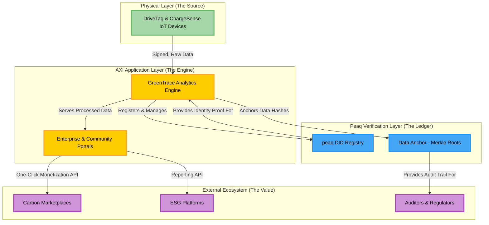

## Complete Operational Flow

### From Physical Asset to Verifiable Digital Value

The AXI Trust Stack transforms real-world clean mobility actions into secure, verifiable, and monetizable digital assets through a seamless 8-step automated process across three distinct phases.

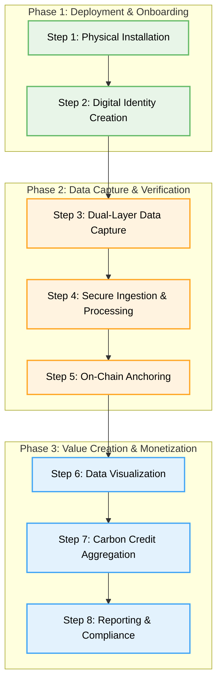

### Phase 1: Deployment & Onboarding

Establishes the secure link between physical assets and their digital identities on Peaq Network.

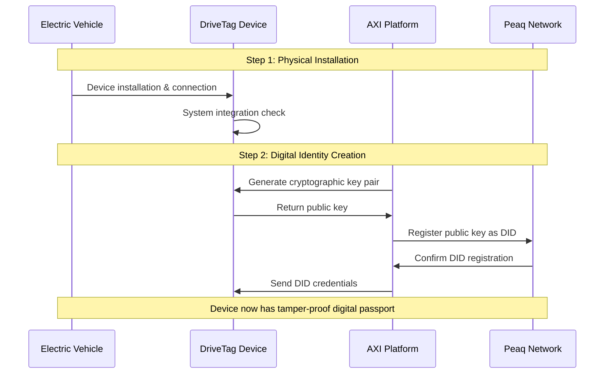

**Step 1: Physical Installation**
- Certified installation partner outfits electric vehicle with DriveTag IoT device
- Device connects to vehicle's internal systems for telematics data access

**Step 2: Digital Identity Creation**  
- AXI platform generates unique cryptographic key pair during secure commissioning
- Public key registered on Peaq blockchain, creating permanent Decentralized Identifier
- Physical device receives tamper-proof digital passport on public ledger

### Phase 2: Data Capture & Verification

Core Digital MRV (Monitoring, Reporting, and Verification) process ensuring data integrity.

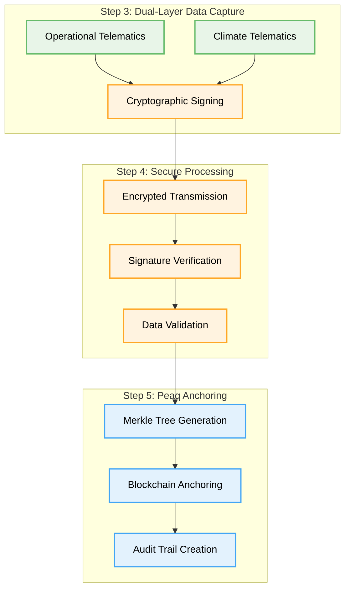

**Step 3: Dual-Layer Data Capture & Source-Signing**
- Operational Telematics: GPS location, speed, trip history, battery state, driver behavior
- Climate Telematics: Exact distance traveled for carbon methodology calculations
- Device's secure element cryptographically signs every data packet with private key

**Step 4: Secure Ingestion & Off-Chain Processing**
- Signed data transmitted via encrypted cellular to GreenTrace Engine
- Signature verification against device's public key from Peaq DID registry
- Invalid signatures flagged and rejected, ensuring only authentic data enters system

**Step 5: On-Chain Anchoring for Auditability**
- Thousands of verified data hashes batched into single Merkle Root
- Merkle Root anchored on Peaq blockchain for immutable audit trail
- Creates permanent, public record for independent third-party verification

### Phase 3: Value Creation & Monetization

Customer interaction with platform to realize financial and strategic value.

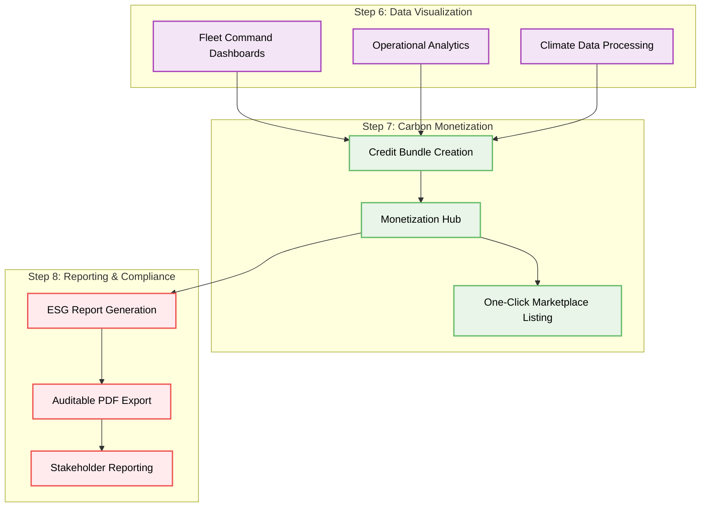

**Step 6: Data Visualization in Enterprise Portal**
- Verified data served to secure Enterprise Oasis Portal
- Fleet Command dashboards enable vehicle tracking, driver monitoring, route optimization
- GreenTrace Engine applies Carbon Avoidance Methodology for CO2 calculations

**Step 7: Carbon Credit Aggregation & Monetization**
- Emissions avoidance data automatically aggregated into standardized Credit Bundles
- Complete bundles (e.g., 1 tonne CO2e) available in Monetization Hub
- Single-click authorization lists high-integrity credits on integrated marketplaces

**Step 8: Reporting & Compliance**
- Same verified dataset generates professional ESG and sustainability reports
- Auditable PDF exports provide investors and regulators with data integrity
- Fleet operators transform daily operations into verifiable revenue and corporate assets

## Tranche 1: Foundation Implementation

### Core Infrastructure Components

Tranche 1 establishes three core infrastructure components on Peaq Network that enable the complete operational flow described above.

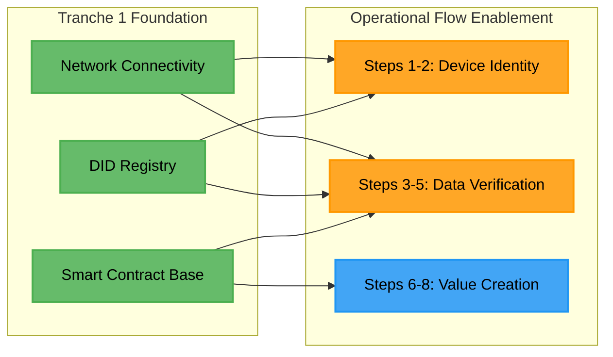

### Milestone 1.1: Secure Network Connectivity Implementation

Establishes reliable connections to Peaq's blockchain infrastructure, enabling Steps 2 and 5 of the operational flow.

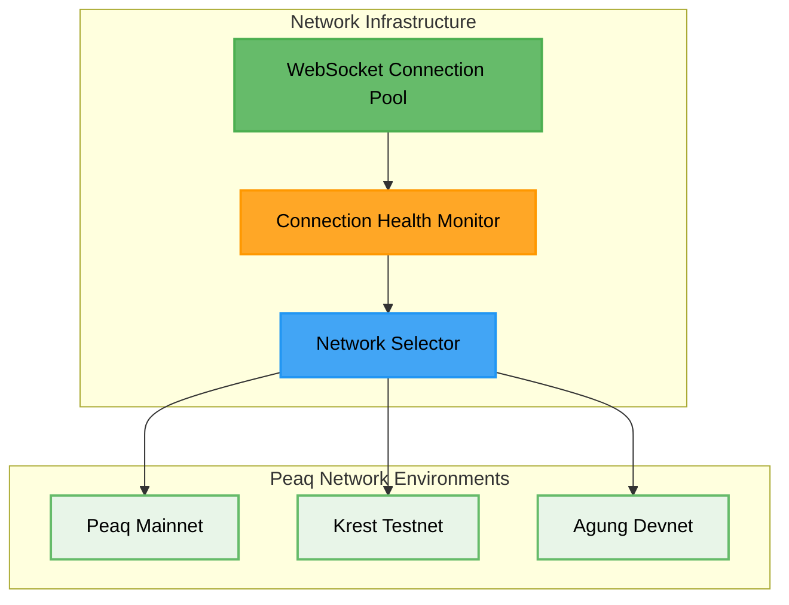

### Milestone 1.2: Decentralized Identity System Implementation

Provides unique, verifiable identities for every IoT device, enabling Step 2 (Digital Identity Creation) and Step 4 (Signature Verification).

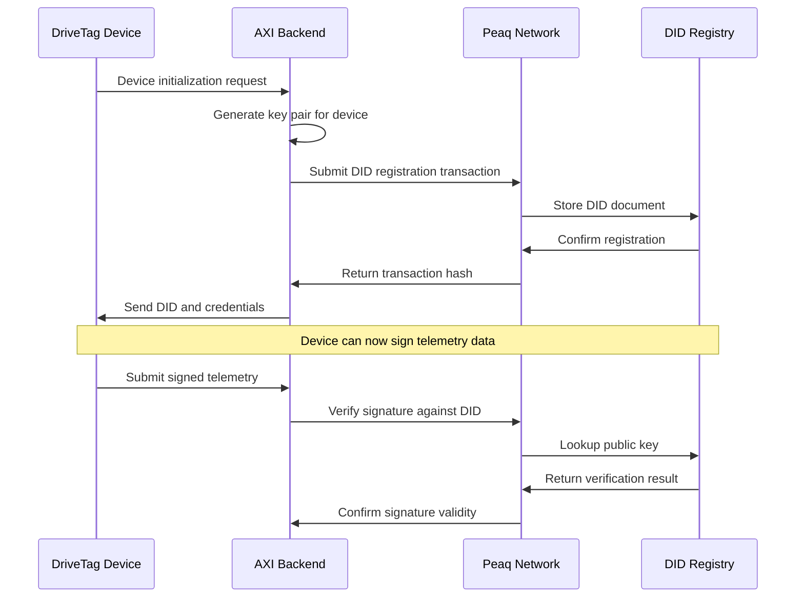

### Milestone 1.3: Smart Contract Infrastructure Development

Implements core business logic for carbon credit generation, enabling Steps 7 and 8 (Value Creation and Reporting).

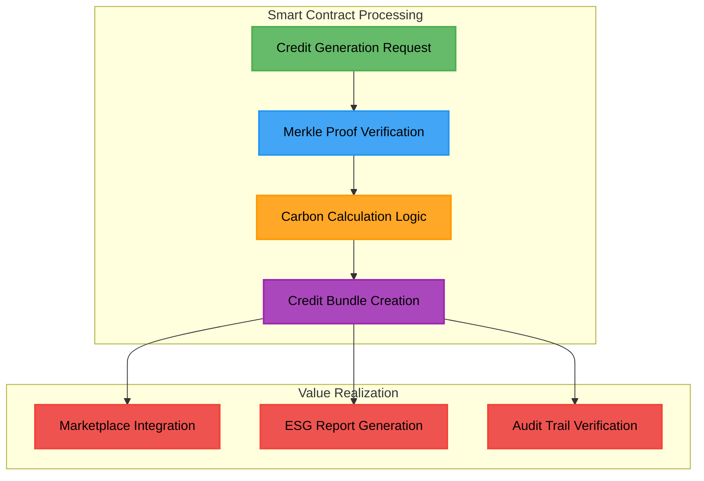

## Technical Integration Flow

### Foundation to Full Operation

Each Tranche 1 component directly enables specific steps in the complete operational flow, creating a logical progression toward full system implementation.

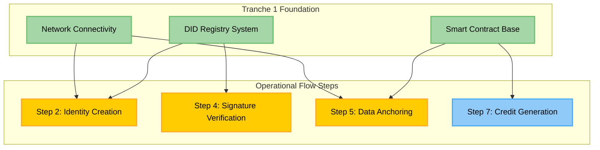

## Development Pipeline

### Three-Phase Implementation Strategy

Each tranche builds specific functionality that enables the next level of operational sophistication.

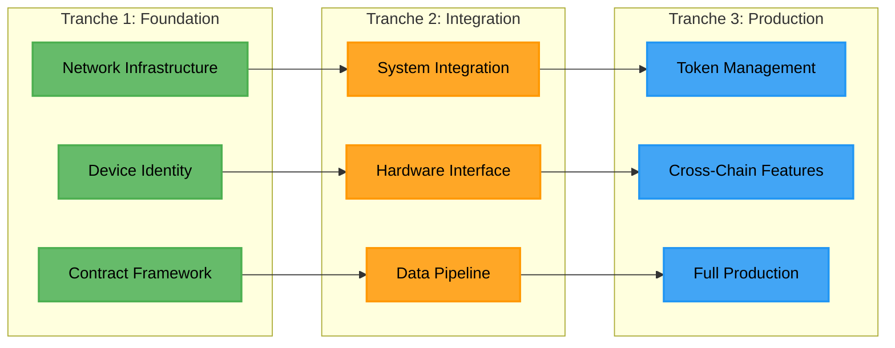

### Technical Capability Progression

Each tranche builds specific functionality that enables the next level of system sophistication:

- **Tranche 1**: Network Foundation, DID Infrastructure, Contract Framework
- **Tranche 2**: Integration Testing, Hardware Interfaces, Data Pipeline  
- **Tranche 3**: Token Management, Cross-Chain Features, Production Launch

### Peaq Network Core Components

Peaq Network manages critical functions across device identity, data verification, and asset settlement for the entire AXI ecosystem.

| Component | Function | Operational Flow Role |
|-----------|----------|----------------------|
| **Peaq DID Module** | Device identity management | Enables Step 2: Digital Identity Creation |
| **Data Anchoring** | Immutable data verification | Enables Step 5: On-Chain Anchoring |
| **EVM Compatibility** | Smart contract execution | Enables Step 7: Carbon Credit Generation |
| **Cross-chain Bridges** | Multi-network connectivity | Enables Step 7: Marketplace Integration |

## Cross-Tranche Dependencies

### Foundation Enablement Matrix

Tranche 1 components directly enable specific capabilities in subsequent development phases.

| Tranche 1 Component | Enables in Tranche 2 | Enables in Tranche 3 |
|--------------------|--------------------- |---------------------|
| **Network Connectivity** | Automated integration testing | Cross-chain bridge deployment |
| **DID Registry** | Hardware device onboarding | Token-based device incentives |
| **Smart Contract Base** | End-to-end data pipeline | Advanced token economics |

### System Evolution Architecture

Each tranche adds functionality layers while maintaining Peaq Network as the foundational data infrastructure.

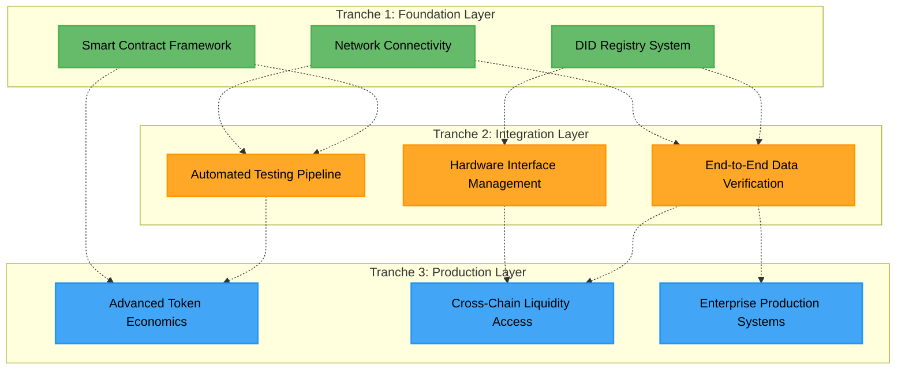

---

**Foundation Status**: Tranche 1 Complete - Enables Steps 2, 4, 5, and 7 of the operational flow  
**Next Phase**: Tranche 2 System Integration - Complete end-to-end operational flow implementation  
**Architecture**: Peaq Network serves as complete blockchain infrastructure for AXI's 8-step operational process
