# AXI: Infrastructure for Tamper-Proof Carbon Intelligence

[](https://opensource.org/licenses/MIT)
[](https://peaq.network)
[](https://chain.link)
[](https://lisk.com)

> **Transforming Carbon Accounting Through Hardware-Verified, Blockchain-Native Infrastructure**

## 🌍 Overview

As global industries race to decarbonize and meet climate mandates, one of the most complex challenges facing enterprises today is the accurate accounting and reporting of carbon emissions—especially Scope 3 emissions generated through external partners, fleets, and infrastructure. Transport and energy-related emissions are particularly difficult to quantify in real time, verify with confidence, and tokenize into trustworthy credits.

**AXI (Autonomous eXchange Infrastructure)** is a revolutionary decentralized data and verification layer that addresses these problems head-on. Built at the intersection of hardware, blockchain, and carbon markets, AXI empowers enterprises, fleet operators, and infrastructure providers to capture and prove the climate impact of their operations with tamper-proof, hardware-signed carbon data.

## 🎯 The Problem We Solve

### 1. 🔍 Data Integrity Crisis
Carbon offset markets have historically relied on:
- ❌ Unverifiable documentation
- ❌ Formula-based estimates
- ❌ Opaque accounting tools
- ❌ Spreadsheet errors leading to millions in fraudulent credits

### 2. 🔄 System Fragmentation
Current emissions data is siloed across:
- GPS logging systems
- Charger networks
- Third-party fleet management systems
- Incompatible data models

### 3. 🌐 Web3 Incompatibility
Massive gap between:
- **Data Source**: EV driving on highway
- **Value Destination**: Registry, marketplace, or on-chain credit buyer

## 💡 Our Solution: Hardware-Signed Carbon Hashes

AXI unifies all layers by anchoring tamper-proof hardware measurements directly to multi-chain blockchain infrastructure through compact, upgradeable devices:

### 🚗 DriveTag (Vehicle Integration)
- Real-time odometer readings
- Battery discharge monitoring (kWh)
- GPS tracking with precision timestamping
- CAN bus integration for vehicle telemetry

### ⚡ ChargeSense (EV Charging Infrastructure)
- Energy flow measurement
- Charging session tracking
- Grid interaction monitoring
- Infrastructure uptime validation

## 🏗️ Technology Architecture

### Core Process Flow

```mermaid
graph TB
    %% Edge Layer
    subgraph EdgeLayer["🔧 EDGE HARDWARE LAYER"]
        DT["`**DriveTag**
        📍 GPS Coordinates
        🛣️ Odometer Readings  
        🔋 Battery kWh
        📊 CAN Bus Data`"]
        
        CS["`**ChargeSense**
        ⚡ Energy Flow
        🔌 Charging Sessions
        📈 Grid Interaction
        ⏱️ Uptime Tracking`"]
        
        SEC["`**ATECC608B Secure Element**
        🔐 CBOR Encoding
        #️⃣ SHA-256 Hashing
        ✍️ ECDSA Signing
        🔑 Non-exportable Keys`"]
    end

    %% Blockchain Layer
    subgraph BlockchainLayer["⛓️ BLOCKCHAIN INFRASTRUCTURE"]
        PEAQ["`**Peaq Network**
        (Substrate Chain)
        
        dataRegistry.storeHash()
        • hash: 0x1a2b...
        • did: did:peaq:0x...
        • timestamp: unix_time
        
        ⚡ 2-second finality`"]
        
        LISK["`**Lisk Sidechain**
        (JavaScript SDK)
        
        Merkle Aggregator:
        • Batch 256 hashes
        • Calculate Merkle root
        • REST API endpoints
        • GraphQL interface
        
        📡 /proof/{merkle_root}`"]
    end

    %% Oracle Layer
    subgraph OracleLayer["🌐 ORACLE & TOKEN LAYER"]
        CHAIN["`**Chainlink OCR**
        
        • Merkle Root Verification
        • Cross-chain Attestation
        • AXI_Carbon_Proof Feed
        • Decentralized Consensus`"]
        
        ETH["`**Ethereum/Polygon**
        
        • ERC-20 Token Standard
        • CCIP Cross-chain Bridge
        • DeFi Integration
        • Public Markets`"]
    end

    %% Token Flow
    subgraph TokenFlow["💰 TOKENIZATION PIPELINE"]
        ARC20["`**ARC-20**
        (Peaq Native)
        
        • Native Tokens
        • On-chain Proofs
        • Low Gas Fees`"]
        
        BRIDGE["`**CCIP Bridge**
        
        Cross-chain
        Token Transfer`"]
        
        ERC20["`**ARC-20.e**
        (Polygon Wrapped)
        
        • DeFi Compatible
        • High Liquidity
        • Public Trading`"]
    end

    %% Final Output
    CREDITS["`🏆 **VERIFIABLE CARBON CREDITS**
    
    ✅ Hardware-Signed
    ⛓️ Blockchain-Native
    💱 Instantly Tradeable
    🔒 Tamper-Proof`"]

    %% Connections
    DT --> SEC
    CS --> SEC
    SEC -->|WebSocket 2s| PEAQ
    PEAQ -->|Relay Bridge| LISK
    LISK -->|Oracle Feed| CHAIN
    CHAIN --> ETH
    
    PEAQ --> ARC20
    ARC20 --> BRIDGE
    BRIDGE --> ERC20
    ETH --> CREDITS
    ERC20 --> CREDITS

    %% Dark Mode Styling
    classDef edgeStyleDark fill:#1a2332,stroke:#64b5f6,stroke-width:2px,color:#e3f2fd
    classDef blockchainStyleDark fill:#2d1b3d,stroke:#ba68c8,stroke-width:2px,color:#f3e5f5
    classDef oracleStyleDark fill:#1b2e1b,stroke:#81c784,stroke-width:2px,color:#e8f5e8
    classDef tokenStyleDark fill:#332219,stroke:#ffb74d,stroke-width:2px,color:#fff3e0
    classDef creditsStyleDark fill:#3d1a1a,stroke:#ef5350,stroke-width:3px,color:#ffebee

    class DT,CS,SEC edgeStyleDark
    class PEAQ,LISK blockchainStyleDark
    class CHAIN,ETH oracleStyleDark
    class ARC20,BRIDGE,ERC20 tokenStyleDark
    class CREDITS creditsStyleDark
```



### Technology Stack

| Layer | Purpose | Technology | Implementation |
|-------|---------|------------|----------------|
| **Edge Devices** | Sensor-to-proof encoding | STM32L5 MCU, ATECC608B SE, Quectel BG95 | DriveTag & ChargeSense hardware |
| **Registry Chain** | Immutable carbon hash ledger | Peaq Substrate | `storeHash(hash, did, timestamp)` |
| **Merkle Aggregator** | Enterprise REST & proof server | Lisk SDK sidechain | TypeScript modules |
| **Oracle & Bridge** | Public attestation & liquidity | Chainlink OCR, PoR, CCIP | Multi-chain verification |
| **Token Layer** | Carbon credit tokenization | ARC-20 (Peaq) + ERC-20 (Polygon) | Cross-chain compatibility |

### Cryptographic Security

| Component | Security Feature | Implementation |
|-----------|------------------|----------------|
| **Hardware Security** | Non-exportable private keys | ATECC608B Secure Element |
| **Data Integrity** | Tamper-proof hashing | SHA-256 on-device processing |
| **Authentication** | Digital signatures | ECDSA P-256 curve |
| **Verification** | Merkle proofs | 256-hash batching system |
| **Oracle Security** | Decentralized consensus | Chainlink OCR nodes |

## 🔄 How AXI Works: End-to-End Process

### Step 1: Data Capture
```
🚗 Vehicle/Charger Operation
├── GPS coordinates & timestamps
├── CAN odometer readings
├── Battery telemetry (kWh)
└── Energy flow measurements
```

### Step 2: Hash & Sign
```
📊 Raw Data
├── CBOR encoding
├── SHA-256 hashing
└── ECDSA signing (ATECC608B)
```

### Step 3: Post to Peaq
```
⛓️ Blockchain Registry
├── WebSocket submission
├── dataRegistry pallet storage
└── 2-second block inclusion
```

### Step 4: Relay to Lisk
```
🔗 Merkle Aggregation
├── 256 hash batching
├── Merkle root calculation
└── Lisk sidechain posting
```

### Step 5: Oracle & Token
```
🌐 Public Verification
├── Chainlink OCR verification
├── AXI_Carbon_Proof feed
└── ARC token minting & bridging
```

## ✨ Key Features

### 🧩 **Modular Hardware**
- Universal compatibility with vehicles and chargers
- CAN bus integration
- Energy pinout support
- Plug-and-play deployment

### 🧾 **Cryptographic MRV (Measurement, Reporting, Verification)**
- Hardware-verified timestamps
- Cryptographically signed data
- Immutable audit trails
- Real-time validation

### 🔁 **Cross-Chain Proofs**
- Peaq: Immutable storage
- Lisk: REST API access
- Ethereum: Chainlink consumption
- Multi-chain token compatibility

### 🌐 **Enterprise Integration**
- GraphQL APIs
- Webhook notifications
- ESG platform compatibility
- Real-time dashboards

### 💡 **Industrial Grade**
- Secure hardware provisioning
- Firmware OTA updates
- 24/7 monitoring capabilities
- Enterprise SLA support

## 🗺️ Development Roadmap

### ✅ **Tranche 1** (Q2 2025) - Foundation
- [x] Complete Peaq integration
- [x] On-chain signing implementation
- [x] DriveTag/ChargeSense hardware deployment
- [x] dataRegistry pallet verification
- [x] Peaq testnet validation

### 🧪 **Tranche 2** (Q3 2025) - Aggregation Layer
- [ ] Peaq-Lisk relay construction
- [ ] Merkle root batching module
- [ ] Lisk SDK deployment
- [ ] REST API proof endpoints
- [ ] Firmware streaming stabilization

### 🔗 **Tranche 3** (Q4 2025) - Oracle Integration
- [ ] Chainlink OCR Merkle root reading
- [ ] Active Chainlink feed on testnet
- [ ] CCIP bridge deployment
- [ ] ARC token movement to Ethereum testnet

### 📦 **Tranche 4** (Q1 2026) - Pilot Programs
- [ ] Mainnet pilot deployments
- [ ] Partner fleet integration
- [ ] ARC token minting from device activity
- [ ] Test credit sales via partner dashboards

### 🔐 **Tranche 5** (Q2 2026) - Advanced Security
- [ ] zk-SNARK inclusion proofs
- [ ] Proof-of-Reserve safeguards
- [ ] DID registry audit flow
- [ ] Peaq runtime integration

### 🌍 **Tranche 6** (H2 2026) - Ecosystem Launch
- [ ] Public ecosystem launch
- [ ] Third-party builder onboarding
- [ ] Token incentives implementation
- [ ] DAO governance tooling
- [ ] SDK for builders publication

## 🛠️ Development & Contributing

### Prerequisites
```bash
Node.js >= 16.0.0
Yarn >= 1.22.0
Rust (for Substrate development)
```

### Quick Start
```bash
# Clone the repository
git clone https://github.com/axi-mobility/axi-core
cd axi-core

# Install dependencies
yarn install

# Setup environment
cp .env.example .env
# Edit .env with your configuration

# Run tests
yarn test

# Start development server
yarn dev
```

### Contributing Guidelines

We welcome contributions! Please follow these guidelines:

1. **Code Standards**
   - Follow [Conventional Commits](https://conventionalcommits.org/)
   - Lint code before submission: `yarn lint`
   - Ensure tests pass: `yarn test`

2. **Areas for Contribution**
   - 🔧 Contract coverage and test rigs
   - 🔄 Relay logic improvements
   - 📱 Firmware OTA modules
   - 📊 Third-party dashboards
   - 🌐 Documentation translation
   - 🛠️ Language-specific SDKs

3. **Submission Process**
   - Fork the repository
   - Create feature branch: `git checkout -b feature/amazing-feature`
   - Commit changes: `git commit -m 'feat: add amazing feature'`
   - Push to branch: `git push origin feature/amazing-feature`
   - Open Pull Request

## 📊 Performance Metrics

### Network Performance
| Metric | Peaq | Lisk | Ethereum (via Chainlink) |
|--------|------|------|---------------------------|
| **Block Time** | 2 seconds | 10 seconds | 12 seconds |
| **Finality** | 2 blocks | 103 blocks | 12 blocks |
| **Transaction Cost** | ~$0.001 | ~$0.01 | ~$5-50 |
| **Throughput** | 1000+ TPS | 100 TPS | 15 TPS |

### Hardware Specifications
| Component | DriveTag | ChargeSense |
|-----------|----------|-------------|
| **MCU** | STM32L5 (120MHz) | STM32L5 (120MHz) |
| **Security** | ATECC608B | ATECC608B |
| **Connectivity** | Quectel BG95 (NB-IoT) | Ethernet/WiFi |
| **Power** | 12V Vehicle Bus | 240V AC Input |
| **Storage** | 512KB Flash | 512KB Flash |

## 🤝 Community & Support

### 📱 Social Channels
- **Twitter**: [@axihq](https://twitter.com/axihq)
- **Telegram**: [@axihq](https://t.me/axihq)
- **GitHub**: [github.com/axi-mobility](https://github.com/axi-mobility)
- **LinkedIn**: [AXI Mobility](https://linkedin.com/company/axihq)

### 💬 Getting Help
- Use `#axi` hashtag for community posts
- Submit issues on GitHub for bug reports
- Join our Telegram for real-time support
- Visit our website at [aximobility.com](https://aximobility.com)
- Check documentation and resources online

### 📈 Updates & Progress
We regularly post:
- Engineering development logs
- Grant progress reports
- Partnership announcements
- Technical deep-dives

## 📄 License

This project is licensed under the MIT License - see the [LICENSE](LICENSE) file for details.

You may use, modify, distribute, and deploy this software with attribution.

## 🙏 Acknowledgements

We extend our gratitude to our partners and supporters:

- **🌐 [Peaq Network](https://peaq.xyz)** - For trusted storage and DID runtime support
- **🧠 [Lisk Incubator](https://lisk.com) & [CV Labs](https://cvlabs.com)** - For mentorship and JS-sidechain funding
- **🔗 [Chainlink Labs](https://chain.link)** - For oracle configuration and CCIP architecture
- **🚀 Our Early Testers & DAO Backers** - For believing in verifiable climate action

---

<div align="center">

**Built from the ground up to turn every clean kilometer and kilowatt-hour into public proof.**

*Making carbon accounting as transparent and verifiable as the blockchain itself.*

</div>
